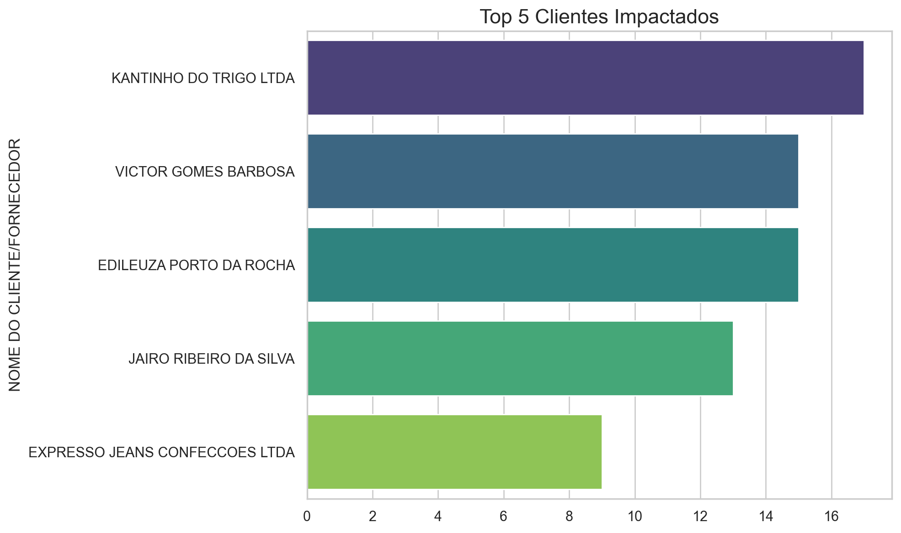
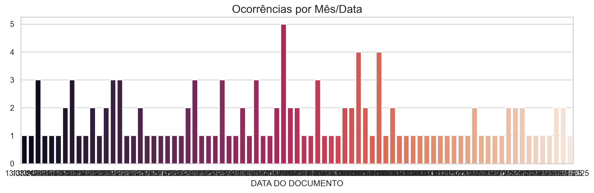
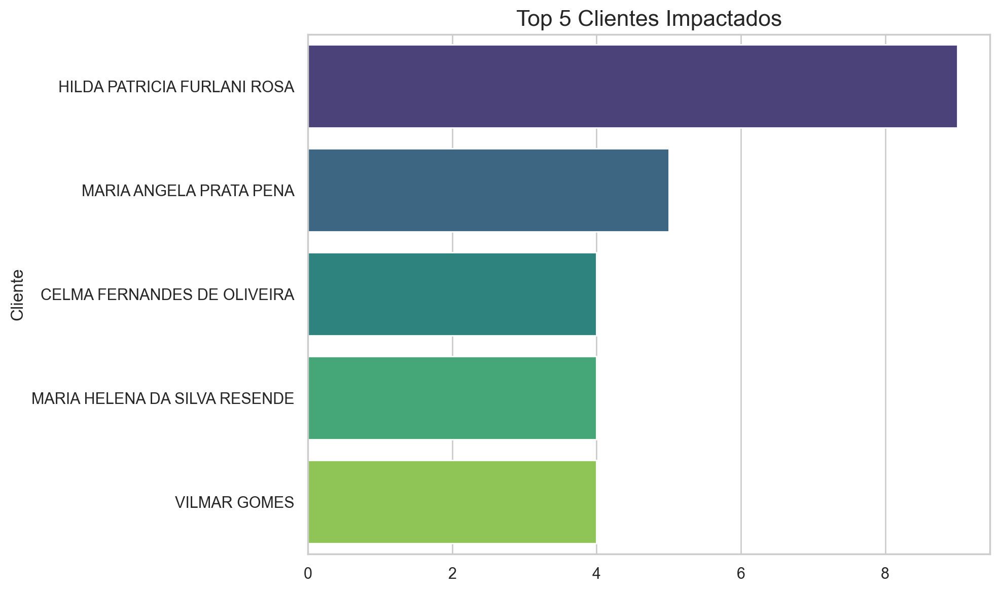
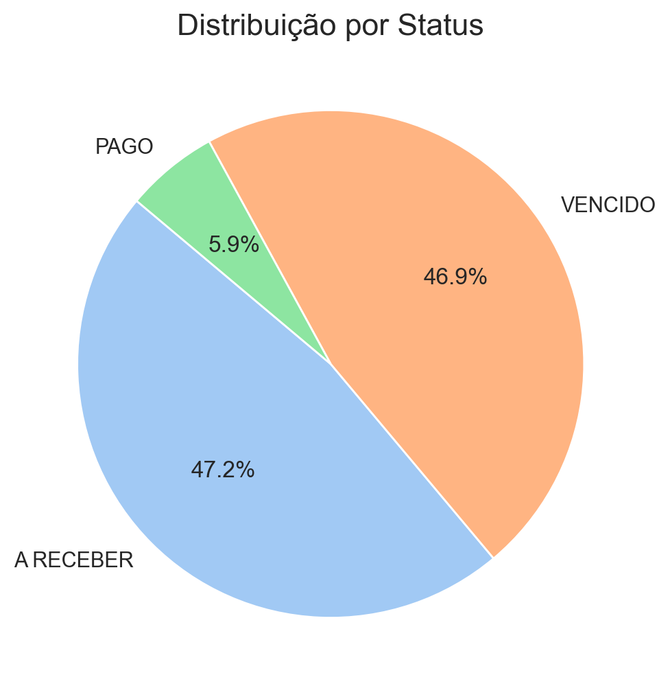
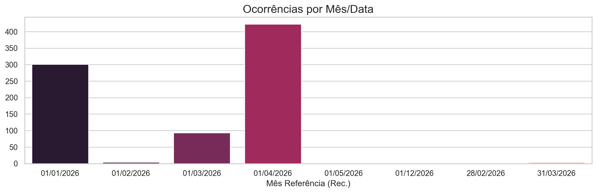
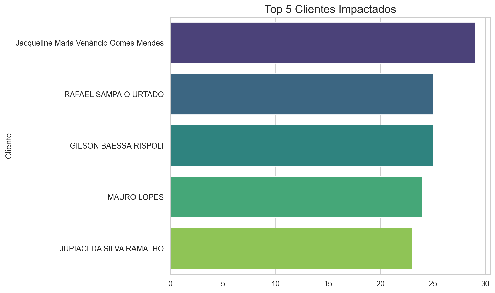
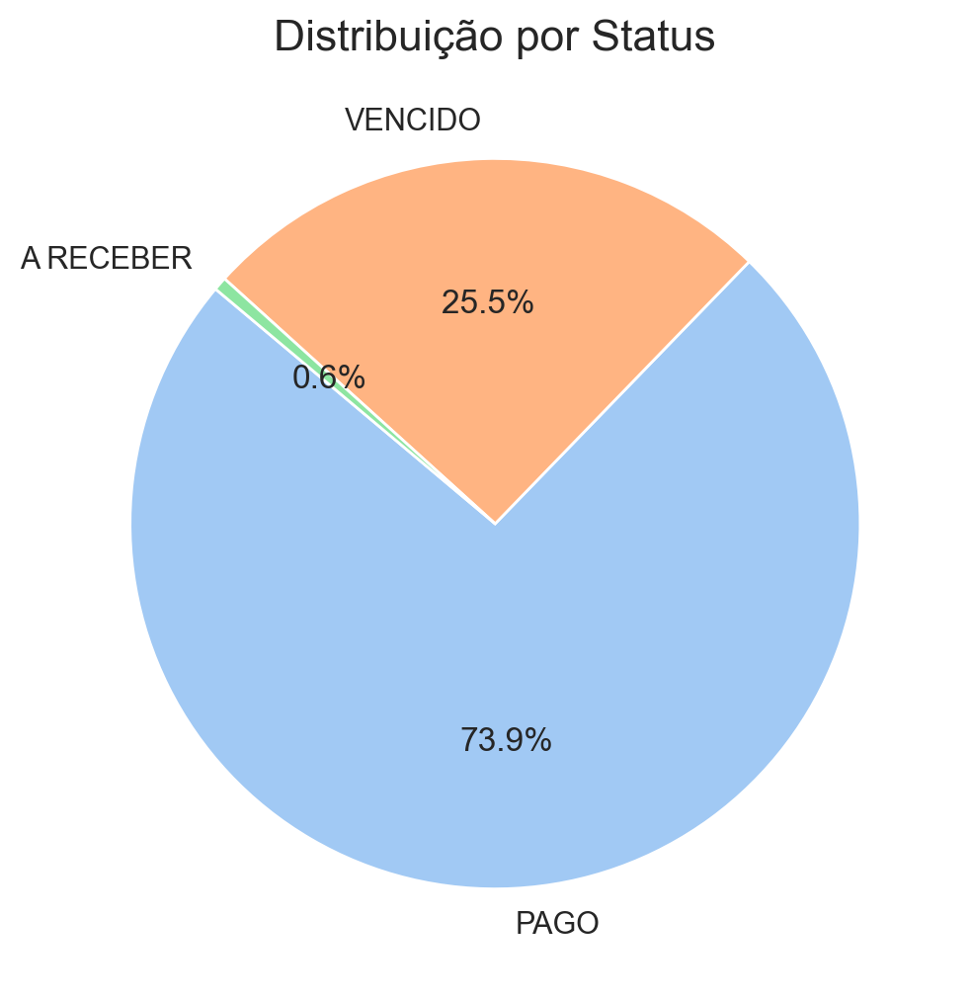
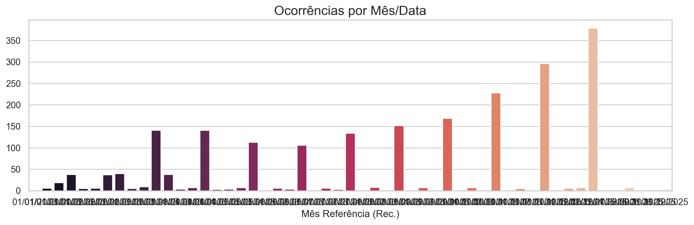

# 📊 Relatório Gerencial - Boletos Faltantes

---

## 📁 Arquivo: `Faltantes_BC.xlsx`

### Resumo Executivo
- **Volume:** 126 boletos faltantes
- **Montante Retido:** R$ 260.317,25

### 💡 Análise para Tomada de Decisão

> **Atenção:** O problema está ALTAMENTE CONCENTRADO. Os top 5 clientes representam **80.5%** de todo o valor financeiro faltante.
> O cliente com maior impacto retido é **KANTINHO DO TRIGO LTDA** (R$ 157.244,49. representando 60,4% do total),

### Top 5 Clientes (Quantidade)

### Ocorrências ao Longo do Tempo

### Amostra de Dados

|       UC | NOME DO CLIENTE/FORNECEDOR     | EMPRESA DO FATURAMENTO                            | DATA DO DOCUMENTO   |
|---------:|:-------------------------------|:--------------------------------------------------|:--------------------|
| 10204714 | EXPRESSO JEANS CONFECCOES LTDA | BC Geracao e Gestao de Ativos de Energia LTDA     | 29/02/2024          |
| 10204714 | EXPRESSO JEANS CONFECCOES LTDA | BC Geracao e Gestao de Ativos de Energia LTDA     | 13/03/2024          |
| 10204714 | EXPRESSO JEANS CONFECCOES LTDA | BC Geracao e Gestao de Ativos de Energia LTDA     | 16/04/2024          |
| 10463320 | KANTINHO DO TRIGO LTDA         | BC Oiti Geração e Comercialização de Energia Ltda | 17/04/2024          |
| 10204714 | EXPRESSO JEANS CONFECCOES LTDA | BC Geracao e Gestao de Ativos de Energia LTDA     | 2024-10-05 00:00:00 |

---

## 📁 Arquivo: `falta_na_pagadoria_filtrados_2026 (NORTHEN).xlsx`

### Resumo Executivo
- **Volume:** 828 boletos faltantes
- **Montante Retido:** R$ 162.327,24

### 💡 Análise para Tomada de Decisão

> O problema é **pulverizado**. Os top 5 clientes representam apenas 18.9% do valor, indicando que é um erro sistêmico geral.
> O cliente com maior impacto retido é **MARIA ANGELA PRATA PENA** (R$ 8.959,25. representando 5,5% do total),

> A maioria dos bloqueios/faltantes está concentrada no status **A RECEBER**. Ação recomendada: Investigar primeiro esta categoria.

### Top 5 Clientes (Quantidade)

### Distribuição de Status

### Ocorrências ao Longo do Tempo

### Amostra de Dados

|   UC (Recebíveis) | UC existe na Pagadoria   |   ID Rcb |   Cód. Cliente |
|------------------:|:-------------------------|---------:|---------------:|
|            603014 | NÃO                      |  3899216 |         211959 |
|            603014 | NÃO                      |  3809550 |         211959 |
|            623319 | NÃO                      |  3899134 |         213314 |
|            623319 | NÃO                      |  3809541 |         213314 |
|            406844 | NÃO                      |  3722063 |         213745 |

---

## 📁 Arquivo: `falta_na_pagadoria_filtrados_2026(CMU).xlsx`

### Resumo Executivo
- **Volume:** 2184 boletos faltantes
- **Montante Retido:** R$ 1.607.047,33

### 💡 Análise para Tomada de Decisão

> O problema é **pulverizado**. Os top 5 clientes representam apenas 27.2% do valor, indicando que é um erro sistêmico geral.
> O cliente com maior impacto retido é **MATEUS AZEVEDO CASTRO** (R$ 131.392,79. representando 8,2% do total),

> A maioria dos bloqueios/faltantes está concentrada no status **PAGO**. Ação recomendada: Investigar primeiro esta categoria.

### Top 5 Clientes (Quantidade)

### Distribuição de Status

### Ocorrências ao Longo do Tempo

### Amostra de Dados

|   UC (Recebíveis) | UC existe na Pagadoria   |   ID Rcb |   Cód. Cliente |
|------------------:|:-------------------------|---------:|---------------:|
|          45070580 | SIM                      |  1575041 |         235351 |
|        3002079378 | NÃO                      |  2292151 |         372563 |
|        3002079378 | NÃO                      |  2292942 |         372563 |
|        3011382729 | NÃO                      |  2371351 |         217446 |
|        3011382729 | NÃO                      |  2371368 |         217446 |

